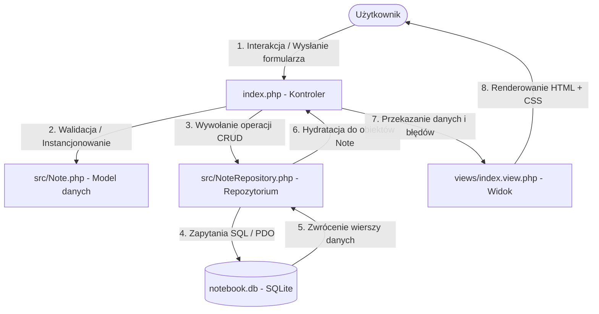

# INSTRUKCJA PROJEKTU: NOTATNIK OSOBISTY (MANUAL.md)

Niniejsza dokumentacja stanowi kompendium wiedzy na temat architektury i kodu źródłowego aplikacji Notatnik Osobisty. Została przygotowana z myślą o obronie projektu przed komisją egzaminacyjną.

---

## 1. Architektura i Przepływ Danych (Architecture Overview)

Aplikacja opiera się na architekturze z wyraźnym rozdziałem odpowiedzialności (separacja warstwy logiki od prezentacji). Przepływ danych w systemie wygląda następująco:

1. **Użytkownik** inicjuje żądanie (np. kliknięcie sortowania, wpisanie wyszukiwania, wysłanie formularza dodawania).
2. **Kontroler (`index.php`)** przechwytuje żądanie, pobiera parametry z tablic superglobalnych `$_GET` i `$_POST`, decyduje o akcji do wykonania.
3. W przypadku zapisu lub edycji, kontroler tworzy obiekt **Modelu (`Note`)**, który waliduje poprawność danych po stronie serwera.
4. Kontroler przekazuje obiekt `Note` do **Repozytorium (`NoteRepository`)**, które przy pomocy interfejsu **PDO** i przygotowanych zapytań (Prepared Statements) komunikuje się bezpiecznie z bazą **SQLite**.
5. Dane pobrane z bazy są zamieniane (hydratowane) z powrotem na obiekty klasy `Note` i przekazywane do **Widoku (`views/index.view.php`)**, który wyświetla je użytkownikowi, dbając o bezpieczeństwo przed XSS (dzięki funkcji `htmlspecialchars()`).

---

## 2. Analiza Kodu i Pojęcia Egzaminacyjne (Block-by-Block Annotation)

Poniższa tabela mapuje kluczowe mechanizmy w kodzie na pojęcia wymagane na egzaminie teoretycznym z języka PHP.

### Plik: `src/Database.php`
* **Plik:** `src/Database.php` | **Lines:** 4-6 | **Action:** Deklaracja klasy `Database` wraz z prywatnym statycznym polem `$instance` przechowującym obiekt połączenia PDO. | **Why it matters for the exam:** **Wzorzec Singleton oraz Hermetyzacja (Encapsulation).** Prywatne i statyczne pole uniemożliwia bezpośrednią modyfikację stanu połączenia z zewnątrz, gwarantując istnienie tylko jednej instancji połączenia w cyklu życia żądania.
* **Plik:** `src/Database.php` | **Lines:** 8-21 | **Action:** Publiczna statyczna metoda `getConnection()`, która inicjuje połączenie z SQLite przy użyciu klasy `PDO`, jeśli połączenie jeszcze nie istnieje, a następnie zwraca tę instancję. | **Why it matters for the exam:** **Leniwa inicjalizacja (Lazy Initialization) i obsługa wyjątków (Try-Catch).** Zapobiega wielokrotnemu otwieraniu połączeń do pliku bazy SQLite. Blok `catch` wyłapuje specyficzny wyjątek bazy danych `PDOException`, co zapobiega wyciekowi wrażliwych informacji (np. ścieżki do pliku).
* **Plik:** `src/Database.php` | **Lines:** 23-33 | **Action:** Prywatna metoda statyczna `initialize()`, która uruchamia polecenie `CREATE TABLE IF NOT EXISTS` bezpośrednio na bazie SQLite. | **Why it matters for the exam:** **Automatyzacja schematu (Schema Bootstrap) oraz poziom dostępu (private).** Metoda jest wywoływana tylko wewnątrz klasy podczas pierwszego połączenia. Ukrycie jej przed światem zewnętrznym realizuje zasadę pojedynczej odpowiedzialności.

### Plik: `src/Note.php`
* **Plik:** `src/Note.php` | **Lines:** 4-10 | **Action:** Definicja pól prywatnych dla obiektu notatki (`$id`, `$title`, `$content`, `$tag`, `$priority`, `$createdAt`) z określeniem typów danych PHP 8 (strict typing). | **Why it matters for the exam:** **Silne typowanie (Type Hinting) i Hermetyzacja.** Zmusza silnik PHP do weryfikacji typów danych w czasie wykonywania, co eliminuje błędy typu type-coercion i zabezpiecza integralność modelu danych.
* **Plik:** `src/Note.php` | **Lines:** 12-28 | **Action:** Konstruktor pobierający tablicę asocjacyjną `$data`, dokonujący rzutowania typów (np. `(int)`) oraz czyszczenia białych znaków za pomocą funkcji `trim()`. | **Why it matters for the exam:** **Metoda magiczna konstruktora (`__construct`).** Umożliwia łatwą instancjonizację modelu zarówno z danych formularza HTTP (`$_POST`), jak i z wiersza bazy danych pobranego przez PDO.
* **Plik:** `src/Note.php` | **Lines:** 54-75 | **Action:** Metoda `validate()` sprawdzająca długość tytułu (`mb_strlen`), wymagane pola oraz poprawność zakresu priorytetu, zwracająca tablicę z błędami. | **Why it matters for the exam:** **Funkcje wielobajtowe (Multibyte Strings) i logika walidacji.** Użycie `mb_strlen` zamiast `strlen` jest krytyczne w języku polskim, ponieważ polskie znaki diakrytyczne (np. ą, ę, ś) zajmują w kodowaniu UTF-8 więcej niż jeden bajt. Standardowe `strlen` zwróciłoby nieprawidłową długość.

### Plik: `src/NoteRepository.php`
* **Plik:** `src/NoteRepository.php` | **Lines:** 9-11 | **Action:** Konstruktor przyjmujący obiekt połączenia `PDO` jako zależność. | **Why it matters for the exam:** **Wstrzykiwanie zależności (Dependency Injection).** Repozytorium nie tworzy samodzielnie połączenia z bazą, lecz otrzymuje je z zewnątrz. Zwiększa to testowalność kodu i ogranicza sprzężenie (loose coupling).
* **Plik:** `src/NoteRepository.php` | **Lines:** 21-53 | **Action:** Metoda `getAll()` budująca dynamiczne zapytanie SELECT z warunkami wyszukiwania, filtrowania tagu/priorytetu oraz sortowania, przy użyciu PDO Prepared Statements. | **Why it matters for the exam:** **Zabezpieczenie przed SQL Injection oraz dynamiczne sortowanie.** Parametry wyszukiwania są bindowane poprzez tablicę w `execute()`. Z kolei kolumny sortowania (`$sortBy`) są weryfikowane za pomocą białej listy (`in_array`), ponieważ nazwy kolumn w SQL nie mogą być przekazywane jako parametry bindowane w przygotowanych zapytaniach.
* **Plik:** `src/NoteRepository.php` | **Lines:** 55-58 | **Action:** Pobranie unikalnych wartości kolumny `tag` w celu dynamicznego zasilenia dropdowna filtrów. | **Why it matters for the exam:** **Zapytania agregujące / unikalne (DISTINCT).** Optymalizuje działanie aplikacji – interfejs pokazuje użytkownikowi tylko te tagi, które rzeczywiście istnieją w bazie danych.
* **Plik:** `src/NoteRepository.php` | **Lines:** 60-85 | **Action:** Metody `save()`, `update()`, `delete()` wykonujące zapytania modyfikujące bazę danych (INSERT, UPDATE, DELETE). | **Why it matters for the exam:** **Prepared Statements (Przygotowane zapytania) i bindowanie parametrów.** Zapewnia, że dane użytkownika są traktowane wyłącznie jako literały, a nie wykonywalny kod SQL, co całkowicie eliminuje podatność SQL Injection.

### Plik: `index.php`
* **Plik:** `index.php` | **Lines:** 4 | **Action:** Wywołanie funkcji `session_start()`. | **Why it matters for the exam:** **Mechanizm sesji HTTP.** Protokół HTTP jest bezstanowy. Sesja pozwala na identyfikację użytkownika i przenoszenie danych (np. komunikatów o sukcesie) pomiędzy przeładowaniami stron.
* **Plik:** `index.php` | **Lines:** 24-58 | **Action:** Obsługa żądań typu POST (`$_SERVER['REQUEST_METHOD'] === 'POST'`), sprawdzanie akcji (create, update, delete), uruchamianie walidacji i przekierowanie nagłówkiem `header("Location: ...")`. | **Why it matters for the exam:** **Wzorzec Post-Redirect-Get (PRG).** Po udanej operacji zapisu/edycji/usuwania kontroler przekierowuje użytkownika metodą HTTP GET na tę samą stronę. Zapobiega to ponownemu wysłaniu formularza (podwójny zapis w bazie) przy odświeżeniu strony przez F5.
* **Plik:** `index.php` | **Lines:** 72-76 | **Action:** Ładowanie plików widoków (`views/index.view.php` oraz `views/layout.view.php`). | **Why it matters for the exam:** **Rozdział Logiki od Prezentacji (Separation of Concerns).** Kontroler przygotowuje dane w zmiennych, a następnie dołącza pliki widoków za pomocą słowa kluczowego `require` / `include`. W widokach nie ma żadnych zapytań SQL ani logiki sterującej aplikacją.

---

## 3. Przykładowe Pytania Egzaminacyjne i Odpowiedzi (Defense Questions)

### Pytanie 1: Co to jest podatność SQL Injection i jak Twój kod zabezpiecza przed nią aplikację?
**Odpowiedź:** 
Podatność SQL Injection polega na wstrzyknięciu złośliwego kodu SQL poprzez dane wejściowe użytkownika, co pozwala na nieautoryzowaną modyfikację lub odczyt bazy danych. W moim projekcie zabezpieczam się przed tym na dwa sposoby:
1. **Prepared Statements (Zapytania przygotowane)**: Korzystam z biblioteki PDO. Wszystkie dane wejściowe przekazywane do zapytań SQL (np. tytuł, treść, tag, ID) są bindowane jako parametry za pomocą `:parametr` i przekazywane w metodzie `$stmt->execute()`. Silnik bazy danych traktuje je wyłącznie jako wartości tekstowe, a nie jako kod wykonywalny.
2. **Biała lista kolumn**: Przy dynamicznym sortowaniu (ORDER BY), gdzie PDO nie pozwala na bindowanie nazw kolumn, filtruję wartość zmiennej `$sortBy` za pomocą instrukcji `in_array` z góry zdefiniowaną tablicą dozwolonych kolumn (`['title', 'priority', 'created_at']`). Jeśli wartość jest spoza listy, wymuszam domyślne sortowanie.

### Pytanie 2: Dlaczego w widokach używasz funkcji `htmlspecialchars()` i przed czym ona chroni?
**Odpowiedź:**
Funkcja `htmlspecialchars()` konwertuje znaki specjalne (takie jak `<`, `>`, `&`, `"`, `'`) na ich encje HTML (np. `<` zamienia na `&lt;`). Chroni to aplikację przed atakami typu **XSS (Cross-Site Scripting)**. Bez tego zabezpieczenia, gdyby użytkownik zapisał w notatce kod JavaScript (np. ``), przeglądarka innego użytkownika (lub nasza po odświeżeniu) wykonałaby ten skrypt. Dzięki `htmlspecialchars()`, skrypt zostanie wyświetlony jako zwykły tekst i nie zostanie uruchomiony.

### Pytanie 3: Wyjaśnij działanie i cel stosowania wzorca Post-Redirect-Get (PRG) w kontrolerze.
**Odpowiedź:**
Wzorzec Post-Redirect-Get zapobiega problemowi ponownego wysłania formularza (np. ponownego dodania tej samej notatki do bazy danych) podczas odświeżania strony w przeglądarce klienta (klawisz F5). 
- Kiedy użytkownik wysyła formularz (żądanie **POST**), serwer przetwarza dane (np. zapisuje notatkę w bazie).
- Po udanym zapisie kontroler wykonuje przekierowanie (instrukcja `header("Location: index.php")` – wysyłając status HTTP 302/303).
- Przeglądarka automatycznie wysyła nowe żądanie typu **GET** pod wskazany adres.
Dzięki temu, gdy użytkownik odświeży stronę, przeglądarka powtórzy ostatnie bezpieczne żądanie **GET**, a nie żądanie **POST**.

### Pytanie 4: Dlaczego używasz `declare(strict_types=1);` na początku plików i co to zmienia w działaniu PHP?
**Odpowiedź:**
Instrukcja `declare(strict_types=1);` włącza tryb ścisłego typowania w pliku, w którym została zadeklarowana. Domyślnie PHP jest językiem słabo typowanym i próbuje automatycznie konwertować typy (np. przekazanie ciągu `"15"` do metody oczekującej liczby całkowitej `int` zostanie zaakceptowane i przekonwertowane). 
Po włączeniu `strict_types=1`, próba przekazania argumentu o niewłaściwym typie (lub zwrócenie niewłaściwego typu z funkcji) wywoła błąd krytyczny `TypeError`. Zwiększa to przewidywalność kodu, bezpieczeństwo i ułatwia wczesne wykrywanie błędów programistycznych.

### Pytanie 5: Czym różni się klasa `Note` od klasy `NoteRepository` w Twoim projekcie i dlaczego nie połączyłeś ich w jedną klasę?
**Odpowiedź:**
Podział ten wynika z zasady pojedynczej odpowiedzialności (Single Responsibility Principle) oraz wzorców projektowych:
- Klasa **`Note`** to tzw. **Model (encja)**. Reprezentuje strukturę pojedynczej notatki w pamięci aplikacji i odpowiada za jej wewnętrzną logikę (np. czyszczenie danych wejściowych, sprawdzanie czy jej pola spełniają warunki walidacji). Nie wie ona nic o istnieniu bazy danych czy plików.
- Klasa **`NoteRepository`** odpowiada za **warstwę dostępu do danych (Data Access Layer)**. Pobiera obiekty `Note` z bazy danych, zapisuje je, modyfikuje i usuwa. 
Gdybyśmy połączyli te dwie klasy (co przypominałoby antywzorzec Active Record), model byłby ściśle powiązany z bazą danych (tzw. tight coupling). Rozdzielenie ich (wzorzec Data Mapper / Repository) sprawia, że możemy łatwo zmienić bazę danych (np. z SQLite na MySQL) modyfikując jedynie klasę `NoteRepository`, podczas gdy klasa `Note` pozostanie całkowicie bez zmian.
